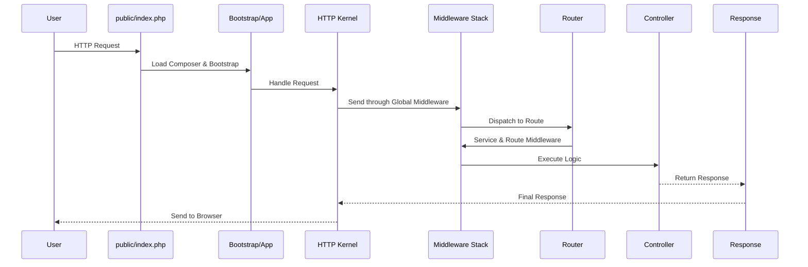
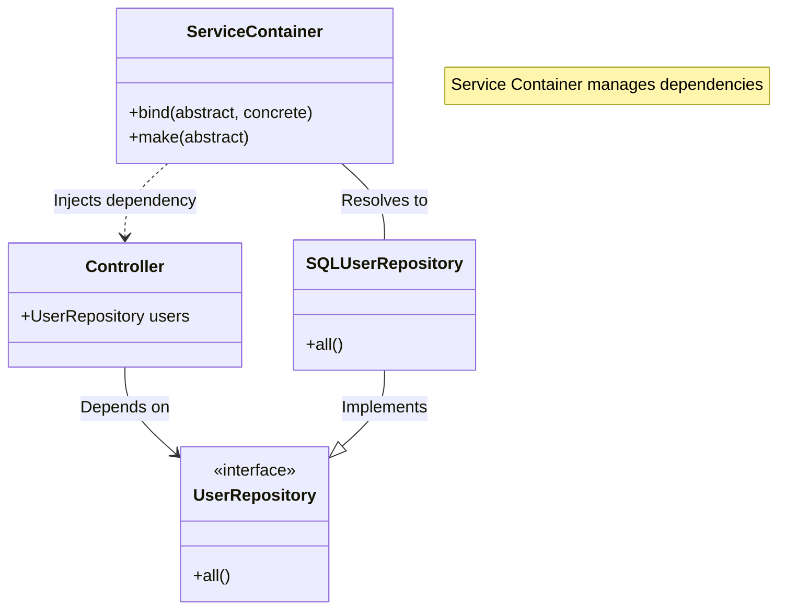

# Laravel 11 Architecture

**[< Previous: Introduction](01-intro.md) | [Next: Installation >](03-installation.md)**

Understanding the "black box" of Laravel is crucial for debugging and building robust applications.

## 1. The Request Lifecycle
Every request in Laravel follows a specific path. Understanding this path helps you know *where* to place your code.



### Key Stages
1.  **Entry Point (`index.php`)**: All requests hit this file first. It loads the Composer autoloader.
2.  **Bootstrapping (`bootstrap/app.php`)**: The application instance is created. This is where the core structure is defined.
3.  **HTTP Kernel**: The request is sent to the kernel. In Laravel 11, this configuration is also centralized in the bootstrap file.
4.  **Service Providers**: This is the most important part of the boot process. All core services (Database, Queue, Validation) are registered here.
5.  **Routing & Middleware**: The request passes through middleware (like checking if a user is logged in) before hitting your controller.

---

## 2. The Service Container
The Service Container is the heart of Laravel. It manages class dependencies and performing dependency injection.

### Concept Visualized
Think of it as a registry where you "bind" a label to a class implementation.



### Dependency Injection in Action
Instead of creating objects manually:
```php
// Bad: Tightly coupled
$users = new SQLUserRepository();
```

You ask for them in your constructor (or method), and Laravel automatically provides them:
```php
// Good: Dependency Injection
class UserController extends Controller 
{
    public function __construct(
        protected UserRepository $users
    ) {}
}
```

## 3. Service Providers
Service Providers are the place where you configure your application (registering bindings, event listeners, middleware). 

In Laravel 11, the structure is simplified:
- **`AppServiceProvider`**: The main place for your application's bootstrapping logic.

## 4. Facades
Facades provide a "static" interface to classes that are available in the application's service container.
- `Route::get()` calls the underlying Router class.
- `Cache::get()` calls the underlying Cache Manager.

They offer the benefit of a terse, expressive syntax while maintaining more testability and flexibility than traditional static methods.
