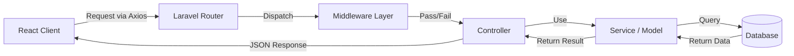

# Architecture & Components

## Overview
The application follows the Model-View-Controller (MVC) architectural pattern, adapted for an API-first design (API consumers serve as the View).

## Component Flow

## 1. Routes (`routes/api.php`)
The entry point for all API requests. All routes inside this file are automatically prefixed with `/api` and have the `api` middleware group applied.

| HTTP Method | URI | Controller Action | Middleware | Description |
| :--- | :--- | :--- | :--- | :--- |
| `POST` | `/register` | `AuthController@register` | Public | Register a new user |
| `POST` | `/login` | `AuthController@login` | Public | Authenticate a user |
| `POST` | `/logout` | `AuthController@logout` | `auth:sanctum` | Revoke current token |
| `GET` | `/hello` | `BasicController@sayHello` | `auth:sanctum` | Fetch user's orders |
| `POST` | `/submit-order` | `BasicController@createOrder` | `auth:sanctum` | Create a new order |
| `PUT` | `/update-order/{id}` | `BasicController@updateOrder` | `auth:sanctum` | Update an order |
| `DELETE` | `/cancel-order/{id}` | `BasicController@deleteOrder` | `auth:sanctum` | Delete an order |

## 2. Controllers (`app/Http/Controllers`)
Controllers handle specific request logic. They validate input, interact with models/services, and return responses.

### `AuthController`
Handles authentication logic.
- **Methods**: `register`, `login`, `logout`
- **Dependencies**: `User` model, `Hash` facade

### `BasicController`
Handles order management logic.
- **Methods**:
    - `sayHello`: Returns list of orders.
    - `createOrder`: Validates and creates a new order.
    - `updateOrder`: Updates an existing order.
    - `deleteOrder`: Removes an order.
- **Authorization**: All methods rely on `$request->user()` to scope data to the authenticated user.

## 3. Services (`app/Services`)
Encapsulate complex business logic to keep controllers lean.

### `GreetingService`
A demonstration service to show how business logic can be separated.
- **Methods**: `greet($name)`
- **Note**: Currently unused in the main order flow but serves as an educational example of Dependency Injection.
