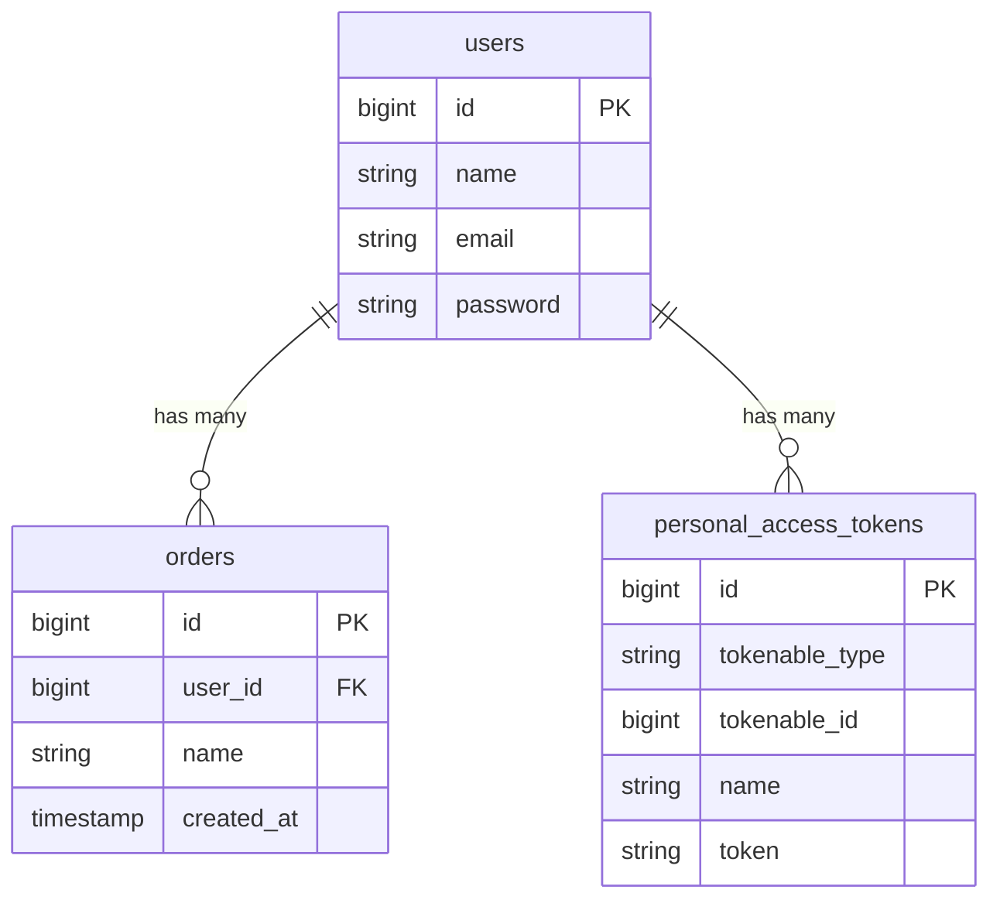

# Database Schema & ERD

## Overview
This project uses SQLite as the database engine. The schema is designed to support user authentication (via Sanctum) and order management where users own their orders.

## Tables

### 1. `users`
Stores user credentials and profile information.

| Column | Type | Attributes | Description |
| :--- | :--- | :--- | :--- |
| `id` | BigInt | PK, Auto Inc | Unique identifier for the user |
| `name` | String | Not Null | User's full name |
| `email` | String | Unique, Not Null | User's email address |
| `email_verified_at`| Timestamp | Nullable | Date of email verification |
| `password` | String | Not Null | Hashed password |
| `remember_token` | String | Nullable | Token for "Remember Me" functionality |
| `created_at` | Timestamp | Nullable | Creation timestamp |
| `updated_at` | Timestamp | Nullable | Last update timestamp |

### 2. `orders`
Stores customer orders. Each order belongs to a specific user.

| Column | Type | Attributes | Description |
| :--- | :--- | :--- | :--- |
| `id` | BigInt | PK, Auto Inc | Unique identifier for the order |
| `user_id` | BigInt | FK (users.id) | Foreign key linking to the user |
| `name` | String | Not Null | Name of the ordered item |
| `created_at` | Timestamp | Nullable | Creation timestamp |
| `updated_at` | Timestamp | Nullable | Last update timestamp |

### 3. `personal_access_tokens`
Stores API tokens generated by Laravel Sanctum.

| Column | Type | Attributes | Description |
| :--- | :--- | :--- | :--- |
| `id` | BigInt | PK, Auto Inc | Unique identifier |
| `tokenable_type` | String | Not Null | Model type (e.g., `App\Models\User`) |
| `tokenable_id` | BigInt | Not Null | ID of the model (User ID) |
| `name` | String | Not Null | Name of the token (e.g., "myapptoken") |
| `token` | String | Unique, Not Null | Hashed token value |
| `abilities` | Text | Nullable | JSON array of permissions |
| `last_used_at` | Timestamp | Nullable | Date of last usage |
| `expires_at` | Timestamp | Nullable | Token expiration date |
| `created_at` | Timestamp | Nullable | Creation timestamp |
| `updated_at` | Timestamp | Nullable | Last update timestamp |

## Entity Relationship Diagram (ERD)

